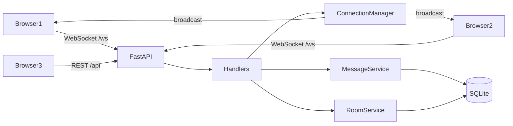

# Relay

A real-time room chat built to teach **FastAPI WebSockets**, async Python, and event-driven design.

Several browsers can connect at once, join rooms, and exchange messages instantly — no polling. Messages persist in SQLite. Presence, join/leave, typing, and reconnect are all first-class events on a documented JSON protocol.

Relay is a working product, not a single-file echo demo. Transport, connection management, business logic, persistence, and validation live in separate modules so you can study each idea in isolation.

## Why WebSockets

HTTP is a request/response contract. The client asks; the server answers; the connection is gone.

A chat room cannot wait for the next request. When Ada types, Jace’s browser has to learn about it *now*, even though Jace did not ask. That is a **push**. WebSockets keep a TCP connection open after the HTTP handshake so either side can send frames at any time.

```
HTTP:   client ──request──► server ──response──► client   (done)

WS:     client ──upgrade──► server
        client ◄──frame──► server
        client ◄──frame──► server     (minutes later, still open)
        client ──close────► server
```

FastAPI’s `@app.websocket("/ws")` accepts that upgrade, then an `async` loop reads frames until the browser disconnects (or the network dies).

REST is still the right tool for resources with a natural request/response shape. Relay splits the work:

| Job | Transport | Why |
|---|---|---|
| Health check | `GET /health` | One-shot, cacheable, load-balancer friendly |
| List / create rooms | `GET/POST /api/rooms` | CRUD; easy to test with curl |
| Message history | `GET /api/rooms/{id}/messages` | Fetch-on-demand, not a live stream |
| Live messages, presence, typing | WebSocket `/ws` | Many events, one connection |

Creating a room is REST; announcing “a room exists now” to every open socket is a WebSocket `room.created` event. That interoperability is the point.

## Architecture

```
realtime-chat/
├── app/
│   ├── main.py                 # factory, lifespan, /ws route
│   ├── api/                    # REST
│   ├── websocket/
│   │   ├── events.py           # canonical event names
│   │   ├── manager.py          # connections, rooms, fan-out
│   │   └── handlers.py         # JSON → validate → services → events
│   ├── models/                 # SQLAlchemy
│   ├── schemas/                # Pydantic v2
│   ├── services/               # rooms, messages, validation
│   └── database/               # async engine
├── src/                        # browser client (WebSocket API)
├── tests/
└── README.md
```



Separation of concerns:

- **Transport** — FastAPI HTTP + WebSocket routes (`app/main.py`, `app/api/`)
- **Connection management** — `ConnectionManager` (who is connected, which room they are in)
- **Business logic** — `app/services/` (create room, persist message, validate username)
- **Persistence** — SQLAlchemy 2 async + SQLite
- **Validation** — Pydantic models; malformed frames never crash the loop

## Event protocol

Every frame is JSON with a `type`, optional `room_id`, and a `data` object.

```json
{
  "type": "chat.message",
  "room_id": "general",
  "data": { "message": "Hello world" }
}
```

Names live in `app/websocket/events.py` and `src/lib/chat/protocol.ts`. Do not invent stringly-typed events in handlers.

| Event | Direction | Notes |
|---|---|---|
| `connection.ready` | server → client | Identity, room list, online names |
| `room.join` / `room.joined` | both | Client asks; server confirms with history + members |
| `room.leave` / `room.left` | both | Leave current room |
| `chat.message` | both | Server echoes the persisted row (id + timestamp) |
| `chat.edit` / `chat.edited` | both | Author-only; server broadcasts the updated row with `edited_at` |
| `chat.delete` / `chat.deleted` | both | Author-only soft delete; body is cleared, tombstone stays in history |
| `dm.open` | client → server | Open or create a 1:1 thread; server unicasts `room.created` to the peer |
| `cursor.read` | client → server | Advance the last-read cursor (`last_event_id`) |
| `unread.update` | server → one user | Unicast badge: `{ room_id, unread_count }` — not a room broadcast |
| `room.join` + `since_event_id` | client → server | Reconnect catch-up; `room.joined.mode` is `catchup` or `snapshot` |
| `user.joined` / `user.left` | server → room | Presence; skipped if the same username still has a tab in the room |
| `user.typing` | both | Ephemeral; never written to SQLite |
| `room.created` | server → all | Fired after `POST /api/rooms` |
| `error` | server → client | `{ code, message }` — socket stays open |
| `ping` / `pong` | both | Keepalive |

Errors look like:

```json
{
  "type": "error",
  "data": {
    "code": "INVALID_MESSAGE",
    "message": "Message cannot be empty."
  }
}
```

Unknown types, bad JSON, empty bodies, oversized frames, and missing rooms all produce an `error` event. The handler catches them per-frame so one noisy client cannot take down the loop.

Edits and deletes are **author-only**. Identity is the display name on the socket (there is no login), so the interesting constraint is the server checking `row.username == conn.username` before mutating. A rejected edit is an `error` with `NOT_AUTHOR`; the rest of the room never hears about it. Deletes are **soft**: the row stays, `deleted_at` is set, and the body is cleared so late joiners see a tombstone instead of a hole.

```json
{ "type": "chat.edit", "room_id": "general", "data": { "id": "…", "message": "fixed typo" } }
{ "type": "chat.delete", "room_id": "general", "data": { "id": "…" } }
```

The server answers with `chat.edited` / `chat.deleted` to **every** socket in that room, including the author, so all clients share one canonical row (same as `chat.message`).

## Unread, DMs, and catch-up

These three sit on top of the same manager; they are how Relay stops being “the room you are in right now.”

**Unread (last-read cursor).** SQLite `last_reads` stores `(username, room_id) → last_event_id`. Joining a room advances the cursor to the latest `seq`. A message posted while you are *not* in that room increments unread only if you have visited it before — “new since you left,” not a badge on rooms you never opened. The badge is a **unicast** `unread.update`, because the other user is looking at a different room and would miss a room broadcast.

**Direct messages.** `dm.open` creates a `kind=dm` room keyed by the sorted pair of names. Delivery uses `ConnectionManager.send_user`: every live socket owned by that username, even if they are currently in `#general`. That is the opposite of `broadcast_room`. REST `GET /api/rooms` never lists DMs, so a third client cannot discover the thread.

**Catch-up.** Every persisted message has a monotonic `seq` (`event_id` on the wire). The browser remembers the last seq per room. On reconnect it sends `room.join` with `since_event_id`. If the gap fits in the history window, `room.joined.mode` is `catchup` and the client **appends** instead of wiping the pane. If the gap is larger than the retained window, the server falls back to a full snapshot.

```json
{ "type": "room.join", "room_id": "general", "data": { "since_event_id": 41 } }
```


## Connection manager

`ConnectionManager` is the in-process map of live sockets. Conceptually:

```
connections: dict[connection_id, Connection]   # socket + username + current room
rooms:       dict[room_id, set[connection_id]]
```

It is deliberately **not** a FastAPI route. Handlers call `connect`, `join_room`, `broadcast_room`, `disconnect`. That keeps the manager testable and makes a future Redis adapter a swap, not a rewrite.

On disconnect (tab close, network drop, `close()`), the manager:

1. Removes the connection id from `_connections`
2. Removes it from its room set
3. Broadcasts `user.left` only if that username has no remaining sockets in the room

## How state is managed

There are two stores of truth, on purpose.

| State | Where | Why |
|---|---|---|
| Chat history | SQLite (`messages`) | Survives process restart; loaded when you join a room. Edits set `edited_at`; deletes set `deleted_at` and clear the body |
| Rooms | SQLite (`rooms`) | Created over REST, seeded with `general`, `random`, `development` |
| Who is online | In-memory `ConnectionManager` | Presence is *now*. A DB row cannot tell you a socket is alive |
| Last-read cursors | SQLite (`last_reads`) | Unread is derived: messages with `seq` greater than this, not authored by you |
| Typing | Memory + client timers | Ephemeral; expires in ~2.5s |

When you join a room the server sends recent history so the pane is not empty. Typing never hits the database.

## Concurrency

Uvicorn runs an asyncio event loop. Coroutines interleave at `await` points — there are no worker threads on the WebSocket path.

Assumptions, documented in `manager.py`:

- Mutations of the connection/room maps happen under an `asyncio.Lock`.
- The lock is **released before** `send_json`. Holding it across a network write would stall every other join, leave, and broadcast on this process.
- Targets are snapshotted (`list(...)`) so a disconnect mid-fan-out cannot mutate the set we are iterating.
- A failed send marks that socket stale; cleanup runs after the broadcast.
- Database access uses SQLAlchemy’s async engine (`aiosqlite`) so a slow disk write cannot block other sockets.

Race that we accept: a socket that joins a room *during* a broadcast may miss that one frame. At-most-once for in-flight events. Chat history still lands in SQLite, so a late joiner sees it on `room.joined`.

## Reconnects

The browser treats a closed socket as a recoverable fault, not a dead app.

1. Status badge: **Connected** / **Reconnecting…** / **Disconnected**
2. Exponential backoff: 500ms → 1s → 2s → 4s → 8s, cap 10s
3. On `connection.ready`, the client re-sends `room.join` for the last room
4. Server reloads history, so the pane recovers membership and messages

Hard refresh starts a new socket; `sessionStorage` keeps the display name for this tab only, so a second tab can enter as someone else.

## How to run

Python 3.10+ and Node 22.

```bash
python -m venv .venv
source .venv/bin/activate
pip install -e ".[dev]"
uvicorn app.main:app --reload --host 0.0.0.0 --port 8000
```

In another terminal, the UI (proxies `/api` and `/ws` to the API):

```bash
npm install
npm run dev
```

`GET /health` should return `{"status": "ok", "service": "relay"}`.

Open two browser windows. Pick different names. Join `#general`. Type. Watch the other pane, the online list, and (terminal icon) the live protocol inspector.

## How to run tests

```bash
source .venv/bin/activate
pytest
```

Coverage:

- REST: health, room listing, room creation, history, 404
- WebSocket: connect, broadcast, room isolation, malformed events, join/leave, disconnect cleanup, typing, history-on-join, `room.created` fan-out

## Scaling past one process

This version keeps presence in memory. That is the right default for learning — you can *see* the dicts. It is also the first thing that breaks in production:

- Two Uvicorn workers → two managers → two realities. A message broadcast in worker A never reaches sockets on worker B.
- Two machines → same problem across the network.

The replacement is not “throw away the manager.” Keep it as the **per-process fan-out adapter** and put a broker behind it:

```
handler → publish(event, room_id) → Redis Pub/Sub
                                    ↓
                         every process’s manager
                                    ↓
                         local sockets in that room
```

SQLite would also move to Postgres. Auth would move in front of the `/ws` handshake. None of that belongs in version 1.

## Security (v1, learning-grade)

- Usernames, room slugs, and message length are validated (Pydantic + explicit regexes)
- Oversized frames are rejected before JSON parse
- The UI renders messages as text (no HTML injection)
- Origin is logged on handshake so you can see where a allow-list would go
- No OAuth. A display name is not an account.

## What to study, in order

1. `app/main.py` — HTTP vs WebSocket routes; lifespan
2. `app/websocket/handlers.py` — the receive loop, why `try/except` is per-frame
3. `app/websocket/manager.py` — why persistent connections need a registry
4. `app/websocket/events.py` — an application protocol on top of frames
5. `src/lib/chat/socket.ts` — backoff, rejoin, the browser `WebSocket` API
6. `tests/test_websocket.py` — two clients, isolation, disconnect
